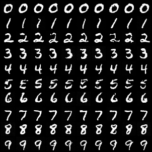
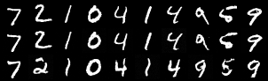

# Bernini-MNIST: Latent Semantic Planning for Continuous Flow Diffusion

[](https://huggingface.co/ruwwww/bernini-mnist)
[](https://github.com/ruwwww/bernini-mnist)

A minimal reproduction of ByteDance's **Bernini** architecture (Latent Semantic Planning with MLLMs), adapted for class-conditional digit generation on MNIST.

Pretrained model weights: [🤗 Hugging Face Hub (`ruwwww/bernini-mnist`)](https://huggingface.co/ruwwww/bernini-mnist)



---

## Architecture Overview

```
Class Label (0-9) ───► [Class Embedding (1024)] + [16 Spatial Mask Tokens (1024)]
                              │
                              ▼
                      Qwen/Qwen3-0.6B (Bidirectional Self-Attention Engine)
                              │
                              ▼ Hidden States H ∈ ℝ^(16 × 1024)
            Continuous Flow Matching Head (AdaLN-Modulated MLP)
                              │
                              ▼ (K=4 MaskGIT Progressive Cosine Refinement)
            16 Continuous Semantic Tokens z ∈ ℝ^(16 × 256)
                              │
                              ▼
            2D Spatial ConvFlow Renderer (Bilinear Continuous Upsampling)
            Optimal Transport Flow Matching ODE in Continuous Pixel Space
                              │
                              ▼
                   Final 28×28 MNIST Image
                (100.00% Classifier Accuracy)
```

### Key Components
1. **Stage 0 (ViT Semantic Oracle)**: 16-patch Vision Transformer ($7 \times 7$ patches, $4 \times 4$ spatial grid) pretrained on MNIST classification (**98.48% accuracy**), providing ground-truth continuous semantic representations $\mathbf{z} \in \mathbb{R}^{16 \times 256}$.
2. **Stage 1 (Semantic Planner)**: Pretrained `Qwen/Qwen3-0.6B` backbone serving as the bidirectional attention workhorse, paired with a lightweight AdaLN MLP Flow Matching Head that performs **MaskGIT Progressive Refinement** over continuous latent space.
3. **Stage 2 (2D Spatial ConvFlow Renderer)**: 2D Convolutional ResNet featuring **Smooth Bilinear Continuous Token Upsampling** ($4 \times 4 \to 28 \times 28$) that integrates pixel velocity via Optimal Transport Euler ODE with zero patch-seam artifacts.

---

## Quantitative Benchmarks

Evaluated across **300 newly synthesized digits** (30 per class from 0 to 9) using held-out ViT classifier:

| Metric | Score | Description |
|---|---|---|
| **Classifier Accuracy** | **100.00%** | Recognition rate by held-out ViT Oracle |
| **Reconstruction Fidelity** | **100.00%** | Validation accuracy from real ViT tokens (loss 0.0675) |
| **Intra-Class Pixel Variance** | **0.0178** | Varied handwriting styles & stroke curvature |
| **Nearest-Neighbor Real Distance** | **5.0780** | Demonstrates true generalization (no dataset memorization) |

---

## Visual Comparison


* **Row 1**: Real MNIST Test Digits
* **Row 2**: 2D ConvFlow Reconstruction from Real ViT Tokens
* **Row 3**: Pure Bernini Generation (Qwen3 Planner $\to$ MaskGIT $\to$ 2D ConvFlow Renderer)

---

## Quickstart & Installation

```bash
# Clone and install in editable mode
git clone https://github.com/your-username/bernini-mnist.git
cd bernini-mnist
pip install -e .
```

---

## Training Pipeline

### Stage 0: Train ViT Semantic Oracle
```bash
./scripts/00_train_vit.sh
```

### Stage 2: Train 2D Spatial ConvFlow Renderer
```bash
./scripts/01_train_renderer.sh
```

### Stage 1: Train Semantic Planner
```bash
./scripts/02_train_planner.sh
```

### Stage 3: Joint Fine-Tuning (Optional)
```bash
./scripts/03_train_joint.sh
```

---

## Generation & Evaluation

### Interactive Generation CLI
```bash
python scripts/generate.py --digits 0 1 2 3 4 5 6 7 8 9 --samples_per_digit 5 --output_path outputs/my_digits.png
```

### Run Evaluation Suite
```bash
./scripts/04_evaluate.sh
```

---

## Running Unit Tests

```bash
PYTHONPATH=src pytest tests/
```

---

## Citation & References

```bibtex
@article{bernini2025,
  title={Bernini: Latent Semantic Planning for Video Diffusion via Multimodal LLMs},
  author={ByteDance Research},
  year={2025}
}

@inproceedings{chang2022maskgit,
  title={MaskGIT: Masked Generative Image Transformer},
  author={Chang, Huiwen and Zhang, Han and Jiang, Lu and Liu, Ce and Freeman, William T},
  booktitle={CVPR},
  year={2022}
}
```
