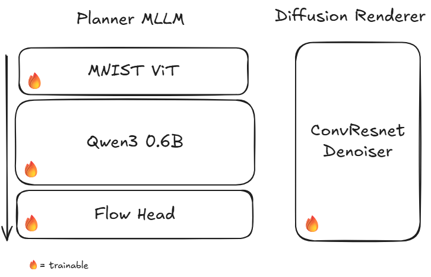

# Bernini-MNIST: Latent Semantic Planning for Continuous Flow Diffusion

[](https://huggingface.co/ruwwww/bernini-mnist)
[](https://github.com/ruwwww/bernini-mnist)

A minimal reproduction of ByteDance's **Bernini** architecture (Latent Semantic Planning with MLLMs), adapted for class-conditional digit generation on MNIST.

Pretrained model weights: [🤗 Hugging Face Hub (`ruwwww/bernini-mnist`)](https://huggingface.co/ruwwww/bernini-mnist)


---

## Architecture Overview



The system decouples visual generation into two focused stages:
1. **Planner MLLM** (`MNIST ViT` + `Qwen3 0.6B` + `Flow Head`): Operates in continuous semantic space, planning the spatial blueprint of the image.
2. **Diffusion Renderer** (`ConvResnet Denoiser`): Takes the planned semantic blueprint and denoises continuous pixels into a clean image.

---

## Quantitative Benchmarks

Evaluated across **300 newly synthesized digits** (30 per class from 0 to 9) using held-out ViT classifier:

| Metric | Score | Description |
|---|---|---|
| **Classifier Accuracy** | **100.00%** | Recognition rate by held-out ViT Oracle |
| **Reconstruction Fidelity** | **100.00%** | Validation accuracy from real ViT tokens (loss 0.0675) |
| **Intra-Class Pixel Variance** | **0.0178** | Varied handwriting styles & stroke curvature |
| **Nearest-Neighbor Real Distance** | **5.0780** | Demonstrates true generalization (no dataset memorization) |

---

## Visual Comparison


* **Row 1**: Real MNIST Test Digits
* **Row 2**: 2D ConvFlow Reconstruction from Real ViT Tokens
* **Row 3**: Pure Bernini Generation (Qwen3 Planner $\to$ MaskGIT $\to$ 2D ConvFlow Renderer)

---

## Quickstart & Installation

```bash
# Clone and install in editable mode
git clone https://github.com/your-username/bernini-mnist.git
cd bernini-mnist
pip install -e .
```

---

## Training Pipeline

### Stage 0: Train ViT Semantic Oracle
```bash
./scripts/00_train_vit.sh
```

### Stage 2: Train 2D Spatial ConvFlow Renderer
```bash
./scripts/01_train_renderer.sh
```

### Stage 1: Train Semantic Planner
```bash
./scripts/02_train_planner.sh
```

### Stage 3: Joint Fine-Tuning (Optional)
```bash
./scripts/03_train_joint.sh
```

---

## Generation & Evaluation

### Interactive Generation CLI
```bash
python scripts/generate.py --digits 0 1 2 3 4 5 6 7 8 9 --samples_per_digit 5 --output_path outputs/my_digits.png
```

### Run Evaluation Suite
```bash
./scripts/04_evaluate.sh
```

---

## Running Unit Tests

```bash
PYTHONPATH=src pytest tests/
```

---

## Citation & References

```bibtex
@article{bernini2025,
  title={Bernini: Latent Semantic Planning for Video Diffusion via Multimodal LLMs},
  author={ByteDance Research},
  year={2025}
}

@inproceedings{chang2022maskgit,
  title={MaskGIT: Masked Generative Image Transformer},
  author={Chang, Huiwen and Zhang, Han and Jiang, Lu and Liu, Ce and Freeman, William T},
  booktitle={CVPR},
  year={2022}
}
```
